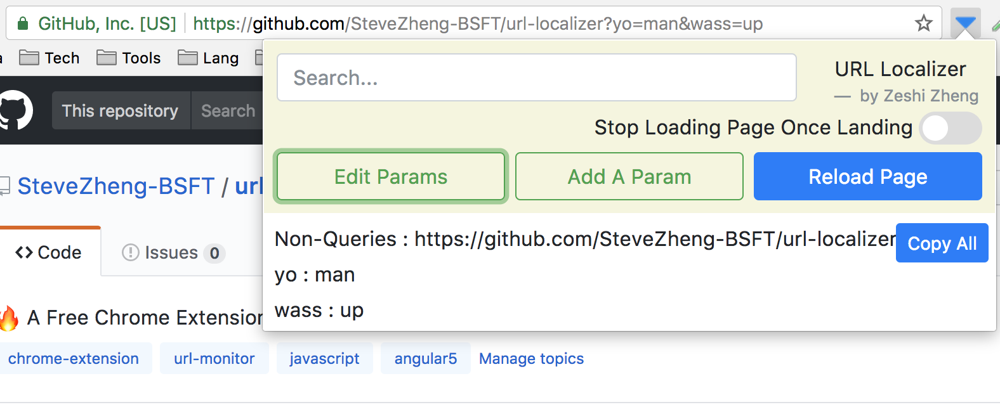
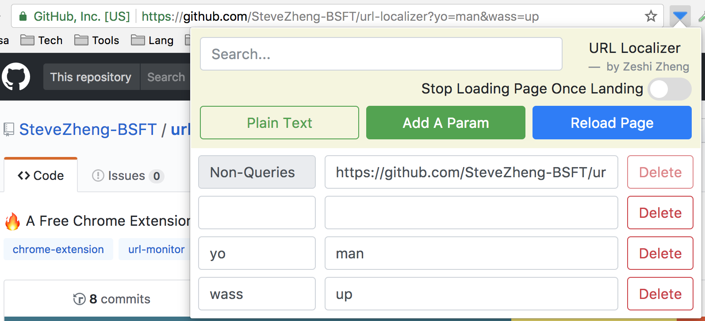
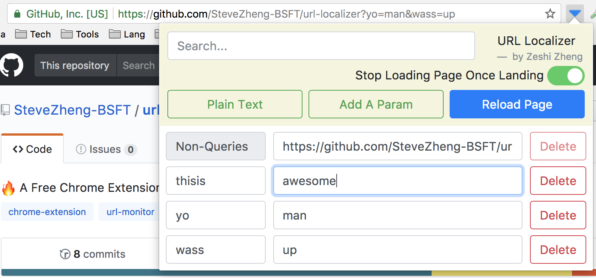
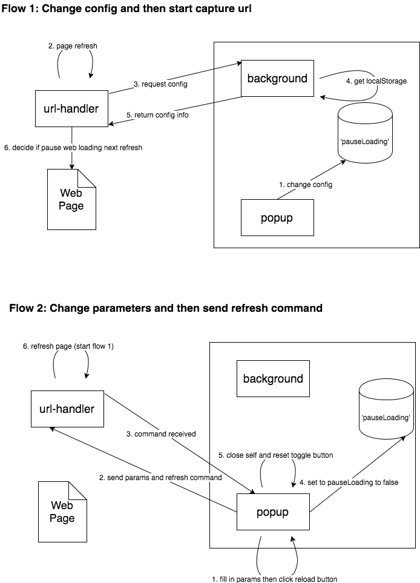

# URL Localizer

This is a Free Chrome Extension that helps engineers to capture and modify url.     

Spread words if you like it! ☘️☘️☘️☘️☘️

## Feature

Version 1.0.0
1. Control if you want to Pause Website Loading before you changing parameters
2. Capture protocol//hostname:port/filepath?queries
3. Edit parameters/domain to whatever you want
4. Add new parameters
5. Delete a parameter
6. Case-ignored Search
7. Copy all parameters easily

Version 1.1.0
1. Can press 'Return' key to trigger refreshing
2. fixed a bug that you can't search in 'plain text' mode
3. Changed confusing words

## Screenshots

🐬  🐬  🐬  🐬  🐬  🐬  🐬  🐬  🐬

🐥  🐥  🐥  🐥  🐥  🐥  🐥  🐥  🐥

🐑  🐑  🐑  🐑  🐑  🐑  🐑  🐑  🐑

## Tech Details

### Frameworks
This project's client is developing using Angular 5.0.0 and Bootstrap 4 beta 2. Background and Content Script is using Javascript.

### Architecture

## Further

You tell me.
